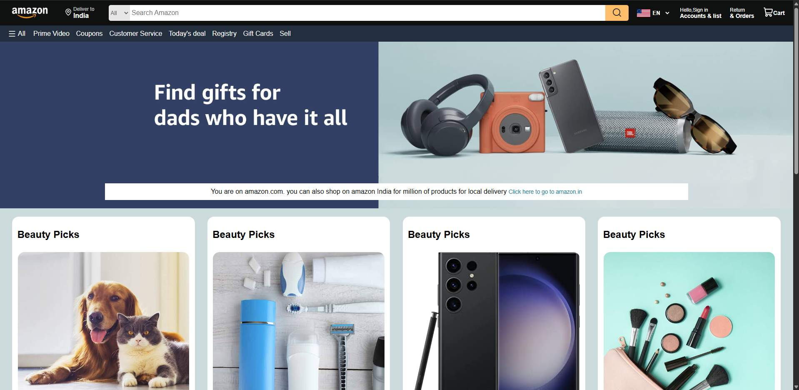

# 🛒 Amazon Homepage Clone

A static clone of the Amazon homepage built using **HTML** and **CSS**. This is my first project after learning the basics of web development, made to practice layout, styling, and structuring a real-world webpage.

> ⚠️ **Disclaimer:** This project is for learning purposes only. It is not affiliated with, endorsed by, or connected to Amazon in any way. All logos, brand names, and images belong to their respective owners.

---

## ✨ Features

- Top navigation bar with logo, search bar, and account/cart links
- Secondary navigation menu with categories
- Hero banner section
- Product category cards in a grid layout
- Product sections with images and titles
- "Back to top" bar and multi-column footer
- Hover effects on buttons and links

## ✨ Features

- Top navigation bar with logo, search bar, and account/cart links
- Secondary navigation menu with categories
- Hero banner section
- Product category cards in a grid layout
- Product sections with images and titles
- "Back to top" bar and multi-column footer
- Hover effects on buttons and links

## 🙋 About Me

Hi! I'm Nishant Sehrawat, a graphic designer learning HTML and CSS. This is one of my first projects, and I'm excited to keep building and improving.

- GitHub: [@nishantsehrawat](https://github.com/nishantsehrawat)
- LinkedIn: [Nishant Sehrawat](https://www.linkedin.com/in/nishantsehrawat)
